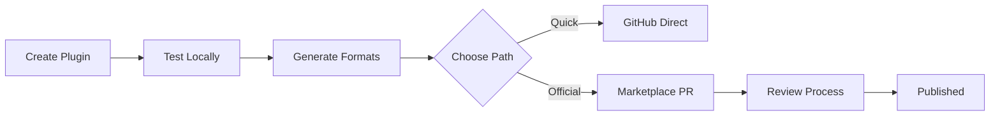

# Publishing Overview

AI Assist Kit provides tools to publish plugins to official marketplaces.

## Supported Marketplaces

| Marketplace | Status | Automation |
|-------------|--------|------------|
| Claude Code | Official | Yes |
| Gemini CLI | Community | Planned |

## Publishing Methods

### 1. Direct GitHub Install

Users can install plugins directly from GitHub without marketplace submission:

=== "Claude Code"

    ```bash
    claude plugin add github:owner/repo/path/to/plugin
    ```

=== "Gemini CLI"

    ```bash
    # Clone and copy manually
    git clone https://github.com/owner/repo
    cp -r repo/plugins/gemini ~/.gemini/plugins/my-plugin
    ```

### 2. Official Marketplace

Submit plugins for inclusion in official marketplaces for discoverability and trust.

## Automated Publishing

AI Assist Kit provides Go code to automate marketplace submissions:

```go
import (
    "context"
    "github.com/agentplexus/aiassistkit/publish/claude"
    "github.com/agentplexus/aiassistkit/publish/core"
)

func main() {
    ctx := context.Background()

    publisher := claude.NewPublisher(os.Getenv("GITHUB_TOKEN"))

    result, err := publisher.Publish(ctx, core.PublishOptions{
        PluginDir:  "./plugins/claude",
        PluginName: "my-plugin",
        DryRun:     true, // Set false for actual submission
    })
    if err != nil {
        log.Fatal(err)
    }

    fmt.Printf("PR URL: %s\n", result.PRURL)
}
```

## Publishing Workflow



## Pre-submission Checklist

Before submitting to any marketplace:

- [ ] Plugin has required metadata (name, version, description)
- [ ] README.md with clear documentation
- [ ] All commands/skills/agents are documented
- [ ] No hardcoded secrets or sensitive data
- [ ] Tested locally with target assistant
- [ ] License file included
- [ ] Repository is public

## Next Steps

- [Submit to Claude Marketplace](claude-marketplace.md)
- [Submit to Gemini Marketplace](gemini-marketplace.md)
